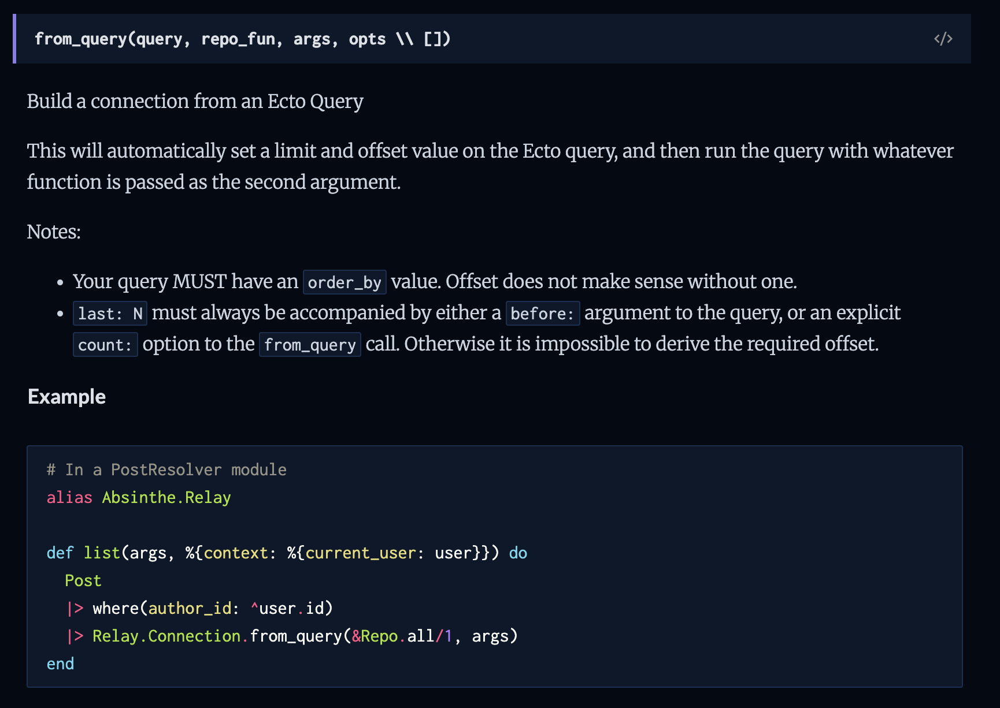

slidenumbers: true
slide-transition: true
footer: Tomasz Tomczyk @ Vetspire

# **Cursor**-Based Pagination at Vetspire

[.footer-style: #737373, alignment(right)]

---

## Context

- **Vetspire** is a B2B SaaS for running your veterinary clinic(s)
- Elixir backend, GraphQL API, React frontend
- Multi-tenancy architecture
- Approaching **4TB** of data in our AlloyDB (GCP's Postgres engine)
- Clients frequently want to export their data via the API
  - That often means **1-200+ million of records** in the bigger tables

^9 year old codebase

[.text-strong: #4BF797]
[.footer-style: #737373, alignment(right)]

---

### Traditional pagination

Sample request: `GET /clients?page=1&limit=2`

```json
[
  { "id": 1, "name": "Alice" },
  { "id": 2, "name": "Bob" }
]
```

---

### Traditional pagination poblems

- Performance degrades with large offsets

`LIMIT 10 OFFSET 10000` makes Postgres scan **10010** records

- Inconsistent results during data changes

_(We'll come back to it)_

[.text-strong: #4BF797]
[.footer-style: #737373, alignment(right)]

---

### What is Cursor-Based Pagination?

Cursor-based pagination uses **cursors** (pointers to specific records):

- `GET /clients?first=2`
- `GET /clients?after=cursor123&first=2`

Common arguments:

- `first, last`
- `after, before`

^You could provide one way pagination with just `first` and `after`

[.footer-style: #737373, alignment(right)]
[.text-strong: #4BF797]

---

## Simple Cursor Pagination - naive

```json
{
  "data": [
    { "id": 1, "name": "Alice" },
    { "id": 2, "name": "Bob" }
  ],
  "next_cursor": "2",
  "has_more": true
}
```

^In this example we may have only requested 2 records. It can be useful and is possible to have pages of different sizes
To get the next page, we need to know which record appeared last on the page the user just got

[.footer-style: #737373, alignment(right)]
[.text-strong: #4BF797]

---

## Generated SQL

```sql
-- First page (no cursor)
SELECT * FROM clients
ORDER BY id ASC
LIMIT 2;

-- Next page (using cursor = last ID)
SELECT * FROM clients
WHERE id > 2
ORDER BY id ASC
LIMIT 10;
```

[.footer-style: #737373, alignment(right)]

---

## Consistency Benefit

**Offset pagination problem**:

```sql
-- Page 1: Get first 10 clients (IDs 1-10)
SELECT * FROM clients ORDER BY id LIMIT 10 OFFSET 0;

-- Client with ID 3 gets deleted

-- Page 2: Get next 10 clients
SELECT * FROM clients ORDER BY id LIMIT 10 OFFSET 10;
-- Problem: You'll skip client with ID 11!
-- (Position 11 became position 10 after deletion)
```

[.footer-style: #737373, alignment(right)]

---

## Consistency Benefit

**Cursor pagination solution**:

```sql
-- Page 1: Get first 10 clients
SELECT * FROM clients WHERE id > 0 ORDER BY id LIMIT 10;
-- Last ID returned: 10

-- Client with ID 3 gets deleted

-- Page 2: Get next 10 clients
SELECT * FROM clients WHERE id > 10 ORDER BY id LIMIT 10;
-- Gets clients with IDs 11-20 - no gaps!
```

[.footer-style: #737373, alignment(right)]

---

## Generated SQL

But for more complex sorting, we need better cursors:

```sql
-- Sorting by name + ID, cursor needs both values
SELECT * FROM clients
WHERE (family_name > 'Anderson' OR
       (family_name = 'Anderson' AND id > 123))
ORDER BY family_name ASC, id ASC
LIMIT 10;
```

^Also problematic if we don't have an auto incremented ID column

[.footer-style: #737373, alignment(right)]

---

## Why Base64 Encode Cursors?

```json
// ❌ Exposing internal structure
"cursor": "family_name:Anderson,id:123"

// ❌ Special characters in URLs
"cursor": "name:O'Connor,id:456"

// ✅ Safe, opaque, URL-friendly
"cursor": "Y3Vyc29yMQ=="
```

Base64 encoding provides:

- **Opacity**: Hides internal cursor structure
- **URL Safety**: No special characters to escape

[.footer-style: #737373, alignment(right)]
[.text-strong: #4BF797]
[.autoscale: true]

---

## Simple Cursor Pagination - naive

```json
{
  "data": [
    { "id": 1, "name": "Alice", "cursor": "bmFtZTpBbGljZSxpZDox" }, // name:Alice,id:1
    { "id": 2, "name": "Bob", "cursor": "bmFtZTpCb2IsaWQ6Mg==" } // name:Bob,id:2
  ],
  "next_cursor": "bmFtZTpCb2IsaWQ6Mg==",
  "has_more": true
}
```

^Your cursor is coupled to your data - not great

[.footer-style: #737373, alignment(right)]

---

## Relay GraphQL Cursor Connections Specification

We aim to conform to the [Relay Specification](https://relay.dev/graphql/connections.htm):

- **Standardized**: Widely adopted pattern in GraphQL
- **Bidirectional**: Support for both forward and backward pagination

apollographql.com/docs/graphos/schema-design/guides/relay-style-connections

^Low surprise factor

[.footer-style: #737373, alignment(right)]
[.text-strong: #4BF797]
[.autoscale: true]

---

## Relay Cursor Pagination Structure

```json
{
  "edges": [
    {
      "node": { "id": 1, "name": "Alice" },
      "cursor": "Y3Vyc29yMQ=="
    },
    {
      "node": { "id": 2, "name": "Bob" },
      "cursor": "Y3Vyc29yMg=="
    }
  ],
  "pageInfo": {
    "hasNextPage": true,
    "hasPreviousPage": false,
    "startCursor": "Y3Vyc29yMQ==",
    "endCursor": "Y3Vyc29yMg=="
  }
}
```

[.footer-style: #737373, alignment(right)]

---

```elixir
# In your schema file
use Absinthe.Relay.Schema, :modern

# For every entity you want to add cursor based pagination to
connection(node_type: :client)

connection field(:accounts, node_type: :client) do
  arg(:filters, :accounts_filters)            # Optional
  arg(:order_by, list_of(:accounts_order_by)) # Optional
  resolve(&AccountsResolver.accounts/3)
end
```

^Accounts because we already have clients - this becomes your query.
Filters and order by optional

[.footer-style: #737373, alignment(right)]
[.autoscale: true]

---

```elixir
# In schema - do once
enum :order_by_direction do
  value(:asc)
  value(:desc)
end

# For every entity you want to allow ordering by
input_object :accounts_order_by do
  field(:family_name, :order_by_direction)
  field(:given_name, :order_by_direction)
  field(:inserted_at, :order_by_direction)
end
```

^My first implementation had dynamic ordering - you could provide any field and it would map to the DB column
Risky as we might not have indexes. Hard to explain what are DB columns vs calculated fields

[.footer-style: #737373, alignment(right)]
[.autoscale: true]

---

## Absinthe Relay is not enough



^You need to handle things such as:
Do we have another page? Need to select +1 row
Do we have a previous page?
Cursor needs to include all the fields
You need to handle the WHERE condition and ORDER BY

[.footer-style: #737373, alignment(right)]

---

## Our Implementation: Absinthe Relay + Keyset Connection

```elixir
{:absinthe_relay, "~> 1.5"},
{:absinthe_relay_keyset_connection, "~> 2.0"}
```

[.footer-style: #737373, alignment(right)]
[.autoscale: true]

---

## Absinthe Relay **Magic** ✨

Automatically generates:

- **first** `(Int)` for forward pagination
- **last** `(Int)` for backward pagination
- **after** `(String)` for forward pagination
- **before** `(String)` for backward pagination
- **pageInfo** field with `hasNextPage`, `hasPreviousPage`, `startCursor`, `endCursor`
- **edges** field with `node` and `cursor` structure

[.footer-style: #737373, alignment(right)]
[.text-strong: #4BF797]
[.autoscale: true]

---

## Absinthe Relay **Magic** ✨

```graphql
type Query {
  accounts(
    filters: ClientFilters
    orderBy: [AccountsOrderBy]
    first: Int # ← Auto-generated
    last: Int # ← Auto-generated
    after: String # ← Auto-generated
    before: String # ← Auto-generated
  ): ClientConnection
}
```

[.autoscale: true]
[.text-strong: #4BF797]
[.footer-style: #737373, alignment(right)]

---

## AbsintheRelayKeysetConnection

```elixir
query = from(c in Vetspire.Accounts.Client)

AbsintheRelayKeysetConnection.from_query(
  query,
  &Vetspire.Repo.all/1,
  %{first: 10, sorts: [%{family_name: :asc}, %{id: :asc}]},
  %{unique_column: :id}
)
```

^**Simplified API**: GraphQL-friendly `order_by` format
**Consistent interface**: Same pattern across all connections

[.footer-style: #737373, alignment(right)]

---

```elixir
%{
  edges: [
    %{
      node: %Vetspire.Accounts.Client{id: 1, ...},
      cursor: "2kXwn5SRWzYyMjQwXQ=="
    },
    %{
      node: %Vetspire.Accounts.Client{id: 2, ...},
      cursor: "4mnwn5SRWzYyMjQxXQ=="
    },
  ],
  page_info: %{
    end_cursor: "4mnwn5SRWzYyMjQxXQ==",
    has_next_page: false,
    has_previous_page: false,
    start_cursor: "2kXwn5SRWzYyMjQwXQ=="
  }
}
```

[.footer-style: #737373, alignment(right)]

---

## Resolver

```elixir
def accounts(_parent, args, %{context: %{current_provider: provider}}) do
  filters = Map.merge(
    args.filters,
    %{distinct: true, org_id: provider.org_id}
  )

  query = Client.query(filters)

  AbsintheRelayKeysetConnection.from_query(
    query,
    &Vetspire.Repo.all/1,
    args,
    %{unique_column: :id}
  )
end
```

^Args has all of first, last, before, after, order by, as well as actual filters
Our base query just needs to filter - ordering and applying the cursor is done in our wrapper
**Automatic ID fallback**: Always adds `id` for consistent sorting
**Performance included**: Default limit (50) prevents unbounded queries, uses read replica

[.footer-style: #737373, alignment(right)]

---

## Frontend Usage (React/TypeScript)

```typescript
const usePagination = () => {
  const [currentCursor, setCurrentCursor] = useState<string | null>(null);
  const [isGoingBack, setIsGoingBack] = useState(false);

  const paginationVariables = useMemo(() => {
    if (isGoingBack) {
      return { last: LIMIT, ...(currentCursor && { before: currentCursor }) };
    }
    return { first: LIMIT, ...(currentCursor && { after: currentCursor }) };
  }, [isGoingBack, currentCursor]);

  return { paginationVariables, setCurrentCursor, setIsGoingBack };
};
```

[.footer-style: #737373, alignment(right)]

---

```typescript
const { paginationVariables, setCurrentCursor, setIsGoingBack } =
  usePagination();

const { data, loading } = useGetAccountsQuery({
  variables: {
    ...paginationVariables,
    filters,
    orderBy,
  },
});
```

[.footer-style: #737373, alignment(right)]

---

## [fit] Demo

[.footer-style: #737373, alignment(right)]

---

## The NULL Values Problem

NULL values in sort columns cause inconsistent cursor behavior

```sql
SELECT * FROM clients
WHERE
  family_name > NULL  -- NULL comparisons are always false!
  AND id > 10
ORDER BY family_name ASC, id ASC;
```

^Also, Ecto just crashes

[.footer-style: #737373, alignment(right)]

---

## The NULL Values Problem

- Get rid of `NULL`s if you can
- If you can't, use **COALESCE** for NULL-safe sorting

```elixir
AbsintheRelayKeysetConnection.from_query(
  query,
  &Vetspire.Repo.all/1,
  %{first: 10, sorts: [%{given_name: :asc}, %{family_name: :asc}, %{id: :asc}]},
  %{unique_column: :id, null_coalesce: %{given_name: "", family_name: ""}}
)
```

_Tip: make sure you have **indexes** on any columns you allow ordering by_

^Edge case with null coalesce, distinct values and custom select

[.footer-style: #737373, alignment(right)]
[.text-strong: #4BF797]

---

## Benefits of Our Approach

✅ **Performance**: Scales better than offset-based pagination
✅ **Consistency**: Results don't shift when data changes
✅ **Relay Compatible**: Standard GraphQL pagination pattern
✅ **Bidirectional**: Support for both forward and backward navigation
✅ **Sorting**: Flexible multi-column sorting support
✅ **Backward Compatible**: No breaking changes to existing IDs

[.footer-style: #737373, alignment(right)]
[.text-strong: #4BF797]

^The main downside
You don't know what cursor pages end on: You can't navigate to a specific page
That's why you can't skip pages in GitHub commit history for example

---

## Not Fully Relay Compliant (Yet)

**What we're missing**: Full Relay spec requires [Node interface](https://hexdocs.pm/absinthe/relay.html)

```elixir
node interface do
  resolve_type(fn
    %Client{}, _ -> :client
    %Patient{}, _ -> :patient
    _, _ -> nil
  end)
end

node object(:client) do
  # This would overwrite our :id field with base64 globally unique IDs
  # Breaking change for existing clients!
end
```

^This requires a globally unique ID on each object and adds ability to query node one at a time by it
Can migrate later (like GitHub and Shopify did)

[.autoscale: true]
[.footer-style: #737373, alignment(right)]
[.text-strong: #4BF797]

---

## Alternatives

- **Flop** https://hex.pm/packages/flop
- **Paginator** https://hex.pm/packages/paginator

[.footer-style: #737373, alignment(right)]
[.text-strong: #4BF797]

---

## [fit] Questions

[.footer-style: #737373, alignment(right)]
