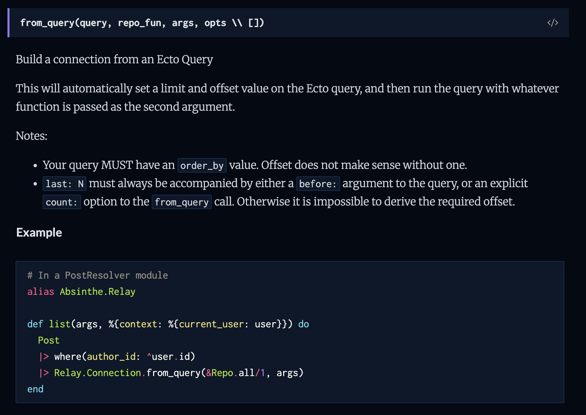

slidenumbers: true
slide-transition: true
footer: Tomasz Tomczyk @ Vetspire

# **Cursor**-Based Pagination in Vetspire

[.footer-style: #737373, alignment(right)]

---

### Traditional pagination

Traditional pagination uses **offset/limit** (page numbers):

- `GET /clients?page=2&limit=10`
- Problems: Performance degrades with large offsets, inconsistent results during data changes

`LIMIT 10 OFFSET 10000` makes Postgres scan **10010** records

[.text-strong: #4BF797]
[.footer-style: #737373, alignment(right)]

---

### What is Cursor-Based Pagination?

Cursor-based pagination uses **cursors** (pointers to specific records):

- `GET /clients?first=10&after=cursor123`
- More efficient, consistent results when sorting by ID (auto-incrementing)

[.footer-style: #737373, alignment(right)]
[.text-strong: #4BF797]

---

## Simple Cursor Pagination - naive

```json
{
  "data": [
    { "id": 1, "name": "Alice", "cursor": "1" },
    { "id": 2, "name": "Bob", "cursor": "2" }
  ],
  "next_cursor": "2",
  "has_more": true
}
```

Next page request: `GET /clients?after=2&limit=10`

^In this example we may have only requested 2 records. It can be useful and is possible to have pages of different sizes

[.footer-style: #737373, alignment(right)]
[.text-strong: #4BF797]

---

## Generated SQL

```sql
-- First page (no cursor)
SELECT * FROM clients
ORDER BY id ASC
LIMIT 2;

-- Next page (using cursor = last ID)
SELECT * FROM clients
WHERE id > 2
ORDER BY id ASC
LIMIT 10;
```

[.footer-style: #737373, alignment(right)]

---

## Consistency Benefit

**Offset pagination problem**:

```sql
-- Page 1: Get first 10 clients (IDs 1-10)
SELECT * FROM clients ORDER BY id LIMIT 10 OFFSET 0;

-- Client with ID 3 gets deleted

-- Page 2: Get next 10 clients
SELECT * FROM clients ORDER BY id LIMIT 10 OFFSET 10;
-- Problem: You'll skip client with ID 11!
-- (Position 11 became position 10 after deletion)
```

[.footer-style: #737373, alignment(right)]

---

## Consistency Benefit

**Cursor pagination solution**:

```sql
-- Page 1: Get first 10 clients
SELECT * FROM clients WHERE id > 0 ORDER BY id LIMIT 10;
-- Last ID returned: 10

-- Client with ID 3 gets deleted

-- Page 2: Get next 10 clients
SELECT * FROM clients WHERE id > 10 ORDER BY id LIMIT 10;
-- Gets clients with IDs 11-20 - no gaps!
```

[.footer-style: #737373, alignment(right)]

---

## Generated SQL

But for more complex sorting, we need better cursors:

```sql
-- Sorting by name + ID, cursor needs both values
SELECT * FROM clients
WHERE (family_name > 'Anderson' OR
       (family_name = 'Anderson' AND id > 123))
ORDER BY family_name ASC, id ASC
LIMIT 10;
```

[.footer-style: #737373, alignment(right)]

---

## Why Base64 Encode Cursors?

```json
// ❌ Exposing internal structure
"cursor": "family_name:Anderson,id:123"

// ❌ Special characters in URLs
"cursor": "name:O'Connor,id:456"

// ✅ Safe, opaque, URL-friendly
"cursor": "Y3Vyc29yMQ=="
```

Base64 encoding provides:

- **Opacity**: Hides internal cursor structure
- **URL Safety**: No special characters to escape
- **Future-proofing**: Can change cursor format without breaking clients

[.footer-style: #737373, alignment(right)]
[.text-strong: #4BF797]
[.autoscale: true]

---

## Relay Cursor Pagination Structure

```json
{
  "edges": [
    {
      "node": { "id": 1, "name": "Alice" },
      "cursor": "Y3Vyc29yMQ=="
    },
    {
      "node": { "id": 2, "name": "Bob" },
      "cursor": "Y3Vyc29yMg=="
    }
  ],
  "pageInfo": {
    "hasNextPage": true,
    "hasPreviousPage": false,
    "startCursor": "Y3Vyc29yMQ==",
    "endCursor": "Y3Vyc29yMg=="
  }
}
```

[.footer-style: #737373, alignment(right)]

---

## Relay GraphQL Cursor Connections Specification

We aim to conform to the [Relay Specification](https://relay.dev/graphql/connections.htm):

- **Standardized**: Widely adopted pattern in GraphQL
- **Consistent**: Same pagination interface across all connections
- **Bidirectional**: Support for both forward and backward pagination

[.footer-style: #737373, alignment(right)]
[.text-strong: #4BF797]
[.autoscale: true]

---

## Absinthe Relay is not enough



^You need to handle things such as:
Do we have another page? Need to select +1 row
Do we have a previous page?
Cursor needs to include all the fields
You need to handle the WHERE condition and ORDER BY

[.footer-style: #737373, alignment(right)]

---

## Our Implementation: Absinthe Relay + Keyset Connection

```elixir
{:absinthe_relay, "~> 1.5"},
{:absinthe_relay_keyset_connection, "~> 2.0"}
```

[.footer-style: #737373, alignment(right)]
[.autoscale: true]

---

```elixir
# In each schema file

use Absinthe.Relay.Schema, :modern

# For every entity you want to add cursor based pagination
connection(node_type: :client)

connection field(:accounts, node_type: :client) do
  arg(:filters, :accounts_filters)            # Optional
  arg(:order_by, list_of(:accounts_order_by)) # Optional
  resolve(&AccountsResolver.accounts/3)
end
```

^Accounts because we already have clients - this becomes your query.
Filters and order by optional

[.footer-style: #737373, alignment(right)]
[.autoscale: true]

---

```elixir

# In schema - do once

enum :order_by_direction do
  value(:asc)
  value(:desc)
end

# For every entity you want to allow ordering by

input_object :accounts_order_by do
  field(:family_name, :order_by_direction)
  field(:given_name, :order_by_direction)
  field(:inserted_at, :order_by_direction)
end
```

^My first implementation had dynamic ordering - you could provide any field and it would map to the DB column
Risky as we might not have indexes. Hard to explain what are DB columns vs calculated fields

[.footer-style: #737373, alignment(right)]
[.autoscale: true]

---

## Absinthe Relay **Magic** ✨

Automatically generates:

- **first** (Int) argument for forward pagination
- **last** (Int) argument for backward pagination
- **after** (String) argument for cursor-based forward pagination
- **before** (String) argument for cursor-based backward pagination
- **pageInfo** field with `hasNextPage`, `hasPreviousPage`, `startCursor`, `endCursor`
- **edges** field with `node` and `cursor` structure

[.footer-style: #737373, alignment(right)]
[.text-strong: #4BF797]
[.autoscale: true]

---

## Absinthe Relay Magic ✨

```graphql
type Query {
  accounts(
    filters: ClientFilters
    orderBy: [AccountsOrderBy]
    first: Int # ← Auto-generated
    last: Int # ← Auto-generated
    after: String # ← Auto-generated
    before: String # ← Auto-generated
  ): ClientConnection
}
```

[.autoscale: true]
[.footer-style: #737373, alignment(right)]

---

```typescript
const { data, loading, error } = useGetAccountsQuery({
  variables: {
     filters: ...
     orderBy: ...
     first: ...
     last: ...
     after: ...
     before: ...
  },
});
```

[.footer-style: #737373, alignment(right)]

---

## AbsintheRelayKeysetConnection vs Vetspire.Pagination

```elixir
AbsintheRelayKeysetConnection.from_query(
  Client.query(),
  &Vetspire.Repo.all/1,
  %{first: 10, sorts: [%{family_name: :asc}, %{id: :asc}]},
  %{unique_column: :id}
)

# Our wrapper

Pagination.paginate(
  Client.query(),
  %{first: 10, order_by: [%{family_name: :asc}]}
)

```

^**Simplified API**: GraphQL-friendly `order_by` format
**Automatic ID fallback**: Always adds `id` for consistent sorting
**Performance included**: Default limit (50) prevents unbounded queries, uses read replica
**Consistent interface**: Same pattern across all connections

[.footer-style: #737373, alignment(right)]

---

## Resolver

```elixir
def accounts(_parent, args, %{context: %{current_provider: provider}}) do
  filters = Map.merge(
    args.filters,
    %{distinct: true, org_id: provider.org_id}
  )

  query = Client.query(filters)
  Vetspire.Pagination.paginate(query, args)
end
```

^Args has all of first, last, before, after, order by, as well as actual filters
Our base query just needs to filter - ordering and applying the cursor is done in our wrapper

[.footer-style: #737373, alignment(right)]

---

## Vetspire.Pagination Usage Examples

```elixir
# Basic usage
Pagination.paginate(Client.query(), %{first: 10})

# With cursor
Pagination.paginate(Client.query(), %{
  first: 10,
  after: "Y3Vyc29yMQ=="
})
```

[.footer-style: #737373, alignment(right)]

---

```elixir
# With sorting
Pagination.paginate(Client.query(), %{
  first: 10,
  order_by: [%{family_name: :asc}]
})

# Multi-column sorting
Pagination.paginate(Client.query(), %{
  first: 10,
  order_by: [%{family_name: :desc}, %{inserted_at: :asc}]
})
```

[.footer-style: #737373, alignment(right)]

---

## Frontend Usage (React/TypeScript)

```typescript
const useClientPagination = () => {
  const [currentCursor, setCurrentCursor] = useState<string | null>(null);
  const [isGoingBack, setIsGoingBack] = useState(false);

  const paginationVariables = useMemo(() => {
    if (isGoingBack) {
      return { last: LIMIT, ...(currentCursor && { before: currentCursor }) };
    }
    return { first: LIMIT, ...(currentCursor && { after: currentCursor }) };
  }, [isGoingBack, currentCursor]);

  return { paginationVariables, setCurrentCursor, setIsGoingBack };
};
```

[.footer-style: #737373, alignment(right)]

---

```typescript
const { paginationVariables, setCurrentCursor, setIsGoingBack } =
  useClientPagination();

const { data, loading } = useGetAccountsQuery({
  variables: {
    ...paginationVariables,
    filters,
    orderBy,
  },
});
```

[.footer-style: #737373, alignment(right)]

---

## Frontend Pagination Controls

```typescript
<Pagination
  onNextClick={() => {
    if (data?.accounts?.pageInfo?.hasNextPage) {
      setIsGoingBack(false);
      setCurrentCursor(data.accounts.pageInfo.endCursor);
    }
  }}
  onPreviousClick={() => {
    if (data?.accounts?.pageInfo?.hasPreviousPage) {
      setIsGoingBack(true);
      setCurrentCursor(data.accounts.pageInfo.startCursor);
    }
  }}
  nextDisabled={!data?.accounts?.pageInfo?.hasNextPage}
  previousDisabled={!data?.accounts?.pageInfo?.hasPreviousPage}
/>
```

[.footer-style: #737373, alignment(right)]

---

## The NULL Values Problem

NULL values in sort columns cause inconsistent cursor behavior

```sql
-- This can cause issues with cursors
SELECT * FROM clients
WHERE family_name > NULL  -- NULL comparisons are always false!
ORDER BY family_name ASC, id ASC;
```

^Also, Ecto just crashes

[.footer-style: #737373, alignment(right)]

---

## The NULL Values Problem

1. **Always include a non-NULL column** (like `id`) in sort order (our default)
2. Ideally, **get rid of `NULL`** values
3. If you can't, **use COALESCE** for NULL-safe sorting

```elixir
Vetspire.Pagination.paginate(query, args, %{
  unique_column: :id,
  null_coalesce: %{given_name: "", family_name: ""}
})
```

_Tip: make sure you have **indexes** on any columns you allow ordering by_

^Edge case with null coalesce, distinct values and custom select

[.footer-style: #737373, alignment(right)]
[.text-strong: #4BF797]

---

## Benefits of Our Approach

✅ **Performance**: Scales better than offset-based pagination
✅ **Consistency**: Results don't shift when data changes
✅ **Relay Compatible**: Standard GraphQL pagination pattern
✅ **Backward Compatible**: No breaking changes to existing IDs
✅ **Bidirectional**: Support for both forward and backward navigation
✅ **Sorting**: Flexible multi-column sorting support

[.footer-style: #737373, alignment(right)]
[.text-strong: #4BF797]

^The main downside
You don't know what cursor pages end on: You can't navigate to a specific page
That's why you can't skip pages in GitHub commit history for example

---

## Testing Strategy

Our tests cover:

- Forward pagination (`first`, `after`)
- Backward pagination (`last`, `before`)
- Multi-column sorting
- Edge cases (empty results, invalid cursors)
- Error handling (invalid limits, malformed cursors)

**You probably don't need to add more tests** - our wrapper, Keyset Connection and Absinthe Relay libraries fully covered.

Only add tests for **custom filtering**.

[.footer-style: #737373, alignment(right)]
[.autoscale: true]
[.text-strong: #4BF797]

---

## Not Fully Relay Compliant (Yet)

**What we're missing**: Full Relay spec requires [Node interface](https://hexdocs.pm/absinthe/relay.html)

```elixir
node interface do
  resolve_type(fn
    %Client{}, _ -> :client
    %Patient{}, _ -> :patient
    _, _ -> nil
  end)
end

node object(:client) do
  # This would overwrite our :id field with base64 globally unique IDs
  # Breaking change for existing clients!
end
```

^This requires a globally unique ID on each object and adds ability to query node one at a time by it
Can migrate later (like GitHub and Shopify did)

[.autoscale: true]
[.footer-style: #737373, alignment(right)]
[.text-strong: #4BF797]

---

## Future

- Max limit, configurable
- Replica option

[.footer-style: #737373, alignment(right)]

---

## [fit] Demo & questions

^Search for "Te" and go to 2nd page, compare before & after

[.footer-style: #737373, alignment(right)]
