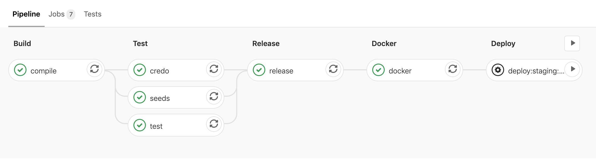

I struggled finding an up to date guide or a template to GitLab pipelines for Elixir. I spent a lot of time tweaking my own and thought it might be useful to share.



First, let's take a look at the whole finished file and I'll explain my reasoning step by step below.

```yaml
image: elixir:1.10.2-alpine

stages:
  - build
  - test
  - release
  - docker
  - deploy

.setup: &setup
  - apk add --no-cache git openssl
  - mix local.hex --force
  - mix local.rebar --force

compile:
  stage: build
  before_script: *setup
  variables:
    MIX_ENV: "test"
  script:
    - mix deps.get
    - mix do clean --only=test, format --check-formatted, compile --warnings-as-errors
  artifacts:
    paths:
      - _build
      - deps
    untracked: true
  cache:
    untracked: true
    key:
      files:
        - mix.lock
    paths:
      - deps
      - _build

test:
  stage: test
  before_script: *setup
  services:
    - postgres:latest
  variables:
    POSTGRES_DB: test
    POSTGRES_HOST: postgres
    POSTGRES_USER: postgres
    POSTGRES_PASSWORD: "postgres"
    MIX_ENV: "test"
  script:
    - mix ecto.create
    - mix ecto.migrate
    - mix test

credo:
  stage: test
  before_script: *setup
  variables:
    MIX_ENV: "test"
  script:
    - mix credo

seeds:
  stage: test
  before_script: *setup
  services:
    - postgres:latest
  variables:
    POSTGRES_DB: test
    POSTGRES_HOST: postgres
    POSTGRES_USER: postgres
    POSTGRES_PASSWORD: "postgres"
    MIX_ENV: "test"
  script:
    - mix ecto.reset

release:
  stage: release
  before_script: *setup
  variables:
    MIX_ENV: "prod"
  script:
    - mix release
  artifacts:
    paths:
      - _build
    untracked: true

docker:
  stage: docker
  image: docker:19.03-git
  dependencies:
    - release
  services:
    - docker:19.03-dind
  script:
    - docker login -u $CI_REGISTRY_USER -p $CI_REGISTRY_PASSWORD $CI_REGISTRY
    - docker build -t "project_name:${CI_COMMIT_SHORT_SHA}" .
    - docker push "${CI_REGISTRY_IMAGE}:${CI_COMMIT_SHORT_SHA}"

.deploy:
  stage: deploy
  script:
    # Deployment specific steps

deploy:staging:
  extends: .deploy
  environment: staging
  when: manual
  variables: ...

deploy:production:
  extends: .deploy
  environment: production
  when: manual
  variables: ...
  only:
    - develop
```

## Step by step

```yaml
image: elixir:1.10.2-alpine
```

I would recommend pinning a specific version of your dependencies. I prefer Alpine distributions due to their lightweight nature. It's important to make sure the operating system matches the one where your application will run (for me, that's later specified in the Dockerfile).

```yaml
stages:
  - build
  - test
  - release
  - docker
  - deploy
```

We override the default stages - it also serves nicely as a table of contents.

```yaml
.setup: &setup
  - apk add --no-cache git openssl
  - mix local.hex --force
  - mix local.rebar --force
```

This is GitLab's syntax for what they call [anchors](https://docs.gitlab.com/ee/ci/yaml/#anchors). It allows us to specify a script that can be reused throughout the file.

Alpine images are great, but per the design they're pretty minimalistic - hence the added package that was needed to get through some of my builds. Try to keep the list minimal and only add what you need. Likewise, we need to add Hex and Rebar to be able to install our Elixir dependencies.

This is the only common addition between the various steps of the build. Ideally, I would suggest expanding on the official Elixir Alpine image and pre-building it, to speed up your pipelines.

```yaml
compile:
  stage: build
  before_script:
    *setup
```

Here's how we use the previously defined setup stage. You'll see this repeated a few times.

```yaml
variables:
  MIX_ENV: "test"
script:
  - mix deps.get
  - mix do clean --only=test, format --check-formatted, compile --warnings-as-errors
```

Here's where we fetch the depndencies and a check that the code has been formatted before compiling it. The main reason for the `MIX_ENV` setting there is so that the work here can be reused in the subsequent steps - where we run our tests. During the release step, we'll build a binary for production environment using releases.

```yaml
artifacts:
  paths:
    - _build
    - deps
  untracked: true
```

Artifacts allow you to keep files in between pipeline stages - read more about [dependencies on GitLab](https://docs.gitlab.com/ee/ci/yaml/#dependencies). It's important to specify that we're interested in keeping the `untracked` files, as otherwise GitLab will follow your `.gitignore` file and you likely have all of those paths ignored. These will be used to speed up the next steps of the pipeline.

```yaml
cache:
  untracked: true
  key:
    files:
      - mix.lock
  paths:
    - deps
    - _build
```

In addition to artifacts, we specify a cache here for the same paths. Cache is kept between entire pipeline executions - it helps to speed it up again. The `files` key allows you to specify a file to be used as a key for the cache. Any time we update any of our packages, cache will be rebuilt. See more about [`cache:key:files` on GitLab](https://docs.gitlab.com/ee/ci/yaml/#cachekeyfiles).

```yaml
test:
  stage: test
  before_script:
    *setup
  services:
    - postgres:latest
  variables:
    POSTGRES_DB: test
    POSTGRES_HOST: postgres
    POSTGRES_USER: postgres
    POSTGRES_PASSWORD: "postgres"
    MIX_ENV: "test"
  script:
    - mix ecto.create
    - mix ecto.migrate
    - mix test
```

The only new thing here is that we can set up a PostgreSQL database through the use of `services` key. This will give us a database to work with for the purpose of the tests. See more about [services on GitLab](https://docs.gitlab.com/ee/ci/docker/using_docker_images.html#what-is-a-service).

```yaml
credo:
  stage: test
  before_script:
    *setup
  variables:
    MIX_ENV: "test"
  script:
    - mix credo
```

[Credo](https://github.com/rrrene/credo) is a static code analysis tool. This will help you catch a number of issues and helps achieve more consistent code.

The only reason to use `MIX_ENV=test` here is to avoid having to do recompilation, as that's how we've compiled earlier for the purpose of tests. I don't believe this impacts much for Credo itself and the things it finds.

```yaml
seeds:
  stage: test
  before_script:
    *setup
  services:
    - postgres:latest
  variables:
    POSTGRES_DB: test
    POSTGRES_HOST: postgres
    POSTGRES_USER: postgres
    POSTGRES_PASSWORD: "postgres"
    MIX_ENV: "test"
  script:
    - mix ecto.create
    - mix ecto.migrate
    - mix run priv/repo/seeds.exs
```

Once again we use the `postgres` service to have a database run through our seeds.

The `credo`, `seeds` and `test` jobs in the pipeline run in parallel thanks to the `stage: test` key.

```yaml
release:
  stage: release
  before_script:
    *setup
  variables:
    MIX_ENV: "prod"
  script:
    - mix release
  artifacts:
    paths:
      - _build
    untracked: true
```

This is where we make use of Elixir releases to get a binary out. At this point it's important we use production environment. We keep the `_build` directory as an artifact for the next step.

```yaml
docker:
  stage: docker
  image: docker:19.03-git
```

We switch from using an Elixir Docker image to a Docker with git image. This is because we've now got everything we needed from Elixir, we have the final binary in place.

```yaml
dependencies:
  - release
```

If we didn't specify that we specifically depend on the `release` stage, all previous artifacts would be downloaded - this is a minor improvement.

```yaml
services:
  - docker:19.03-dind
script:
  - docker login -u $CI_REGISTRY_USER -p $CI_REGISTRY_PASSWORD $CI_REGISTRY
  - docker build --build-arg APP_NAME=${APP_NAME} -t "$(APP_NAME):${CI_COMMIT_SHORT_SHA}" .
  - docker push "${CI_REGISTRY_IMAGE}:${CI_COMMIT_SHORT_SHA}"
```

In general, your Docker / deployment steps will be quite custom to your project & company. I'd suggest keeping it simple - you can use the GitLab registry to store the images. `APP_NAME` is something you can specify in your pipeline environment variables, so that it's easier to reuse the whole pipeline file between projects and make changes.

You can use the `CI_COMMIT_SHORT_SHA` variable to tag your images easily.

## Deployment

I did not include much details in the deployment steps as it largely depends on how you operate. General advice that might be useful:

```yaml
.deploy:
  stage: deploy
  script:
    # Deployment specific steps
```

I would suggest trying to keep staging & production deployment steps as similar as you can - having a reusable anchor helps

```yaml
environment: staging
```

Specifying `environment` key here allows your pipeline to pull environment specific values from your repo's configuration - see more about [variables on GitLab](https://docs.gitlab.com/ee/ci/variables/).

```
  when: manual
```

Thanks to this you can use GitLab Pipeline UI as your deployment tool.

```yaml
only:
  - develop
```

Finally, consider only allowing production deployments from your `develop` or `master` branch.

## Dockerfile

Given you have a binary made in the release step, your `Dockerfile` can be as simple as the following:

```docker
FROM alpine:3.11

ARG APP_NAME

ENV REPLACE_OS_VARS=true
ENV APP_NAME=${APP_NAME}
ENV MIX_ENV=prod
ENV INSTALL_PATH=/app

RUN mkdir -p ${INSTALL_PATH}

WORKDIR ${INSTALL_PATH}

COPY _build/${MIX_ENV}/rel/${APP_NAME}/ "${INSTALL_PATH}/"

ENTRYPOINT ["/bin/sh", "-c", "${APP_NAME} start"]
```
