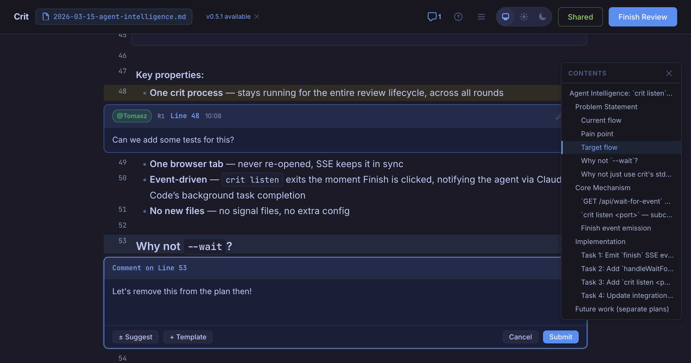
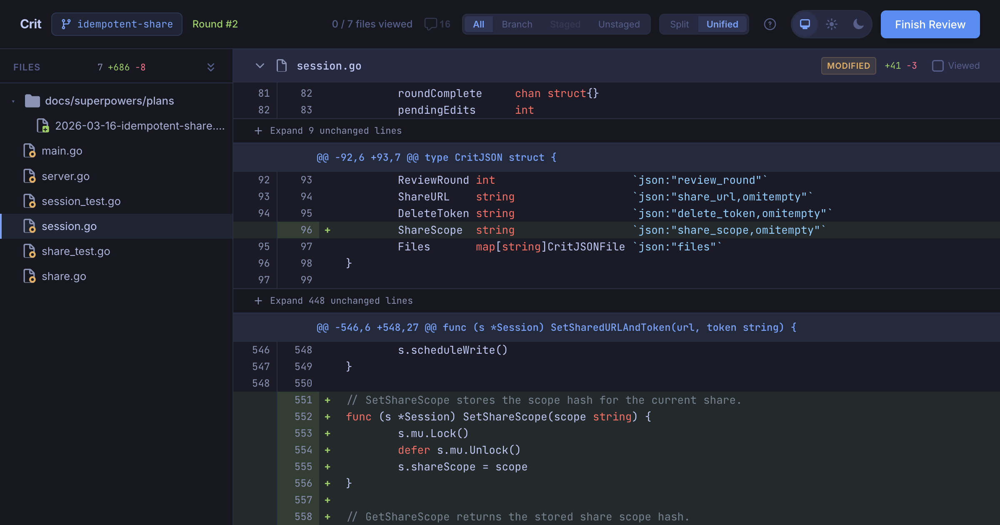

I build [crit](https://github.com/tomasz-tomczyk/crit) - a local-first CLI for reviewing AI agent output with inline comments.

Years ago, Zach Holman gave a great talk called [How GitHub Uses GitHub to Build GitHub](https://zachholman.com/talk/how-github-uses-github-to-build-github/). His point wasn't just "dogfood your tools" - it was that the way you work shapes what you build. GitHub's async, PR-driven culture produced features that supported that culture. Same thing happened here: the way I work with AI agents - plan first, review in rounds, iterate on feedback - ended up shaping what crit became.

The short version: I plan first, review the plan with crit, execute with agents, then review the git diff with crit before shipping. Every feature goes through this loop.

## Step 1: Write the plan, not the code

I used to jump straight into implementation. "Add a way for the agent to know when I've finished reviewing" - and off Claude goes, writing code. The result was always _technically correct_ but architecturally questionable. It would make choices I'd disagree with, and by the time I noticed, we'd already built on top of those choices.

Now I start every feature with planning. I use the [superpowers plugin](https://github.com/obra/superpowers) which has a writing-plans skill. When I say "let's add auto-notification when the human finishes a review", Claude doesn't start coding - it writes a plan.

The output is a markdown plan with clear sections: goals, constraints, architecture decisions, implementation steps. Reviewing long design specs as raw markdown in a terminal isn’t great though.

## Step 2: Review the plan with crit

Here's where the dogfooding kicks in. I run `/crit` and it opens the plan in my browser with full markdown rendering. I read through it like I'd review a design doc and leave inline comments directly on the plan.

The comments are specific, anchored to exact lines in the plan, and they challenge design decisions _before any code exists_.

Having the whole plan rendered beautifully in the browser means it's easier to grasp, interpret code snippets and see how the whole thing fits together. It's actually _fun_ and reduces the mental overhead.

## Step 3: Agent addresses feedback

When I click "Finish Review", Claude picks up the comments automatically. It reads the `.crit.json` file that crit produces, finds my feedback, and revises the plan. It marks each comment as resolved with a note explaining what changed, then triggers a new review round. I see the diff between plan v1 and plan v2 right in the browser. I often do several rounds - refining the approach, challenging assumptions, tightening the scope - until I'm happy with the direction.

## Step 4: Execute the plan

Once the plan is approved, I start a fresh conversation for implementation. This is deliberate - the planning conversation can get long, and a clean context window means Claude focuses on executing rather than getting confused by earlier back-and-forth. The superpowers plugin has an executing-plans skill that works through the plan task by task. Claude writes the code, runs the tests, and moves through the steps methodically.

I'm not watching over its shoulder during this phase. The agent knows what to build, what patterns to follow, and what trade-offs we've agreed on. It's executing, and I can leave it be with more confidence than before while I do other things ☕.

## Step 5: Review the diff with crit

After implementation, I run `/crit` again. It auto-detects the git changes on the current branch and opens a full diff view - syntax-highlighted, file tree on the left with change counts, split or unified view.

This is the second review pass, and it catches different things than the plan review:

- Implementation bugs the agent introduced
- Edge cases it didn't handle
- Code that technically satisfies the plan but in a clumsy way
- Test coverage gaps

I leave inline comments on the diff just like I did on the plan. Same workflow, same UI. Claude reads `.crit.json`, addresses the feedback, and we go another round if needed.

## The loop

So the full loop looks like this:

1. Agent writes implementation plan as markdown (superpowers writing-plans skill)
2. `/crit` - review the plan, leave inline comments
3. Agent revises plan, I review again until approved
4. Agent executes the plan step by step (fresh conversation)
5. `/crit` - review the git diff, leave inline comments
6. Agent addresses feedback, another round if needed
7. Ship

Every feature of crit has gone through this loop. It's slower compared to "just vibe coding it" - but I stopped losing hours to reviewing AI slop and dealing with subtle bugs or inconsistencies - the outcomes are much higher quality.

---

Give [crit](https://github.com/tomasz-tomczyk/crit) a try - `brew install tomasz-tomczyk/tap/crit`. It works with any agent. And if you file an issue for it, well, I'll probably be reviewing the fix with crit.
