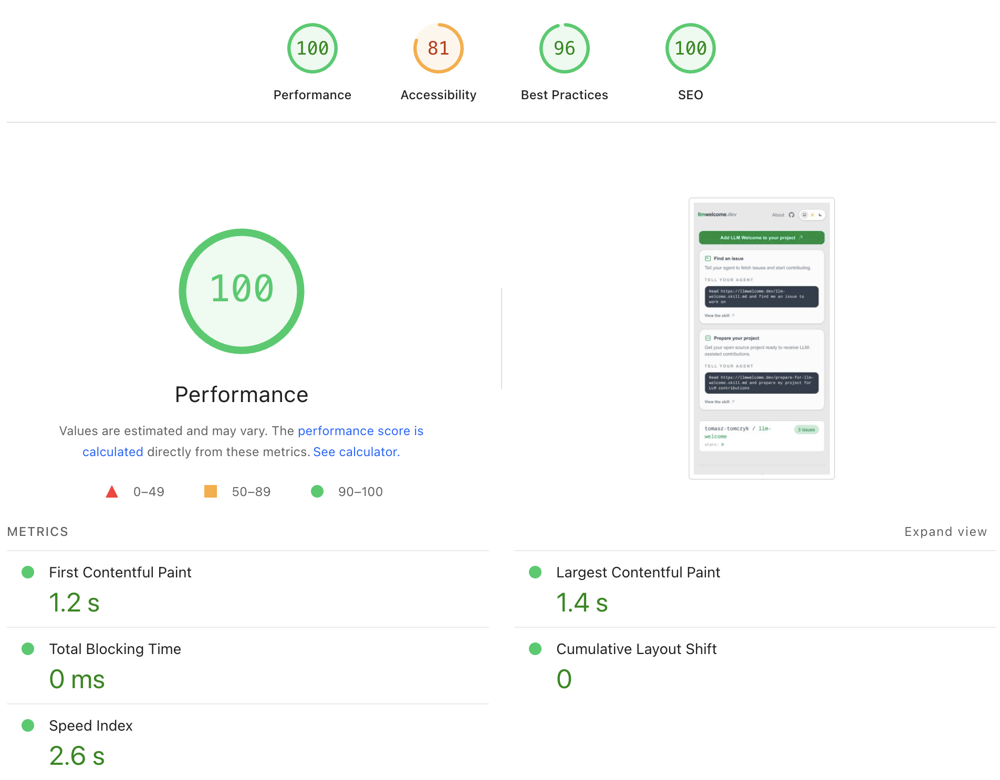
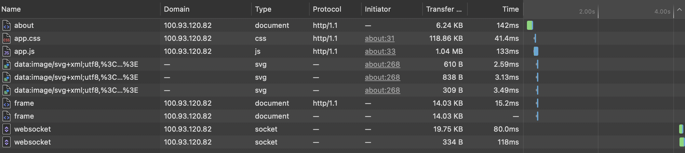

I already had a tendency to chase too many side projects before the LLM era. Now it's easier than ever before to spin something new up! No matter whether these projects end up being successful, without a doubt I've learnt valuable lessons on each one and this is a short story of how Claude caused me to lose several hours chasing a weird bug.

Same story as I've done numerous times before: new [Phoenix](https://phoenixframework.org/) project, basic [DaisyUI](https://daisyui.com/) frontend and a couple LiveView pages, all deployed on [fly](fly.io). Domain purchased, DNS set up, and we're live! Claude assured me my idea is great and we worked together to get a very basic MVP out there. Mere hours later, we had something that resembled an MVP I can share with a couple friends for feedback - but something was wrong.

I try to be a little diligent and test my projects on a few devices - so when I opened the latest one on my iPhone and it took a good 4+ seconds to respond to clicks, I was surprised. _"This is bog standard, fresh out of the box Phoenix LiveView with simple UI - what could possibly be going wrong?"_. The issue only seemed to occur on iPhone Safari 5G and WiFi both. Desktop, any browser - completely fine, ultra responsive.

Server logs show extremely good response rate:

```
app[48e...] lhr [info]19:50:56.485 request_id=GJNJGnYMkIptgB0AAATR [info] GET /about
app[48e...] lhr [info]19:50:56.486 request_id=GJNJGnYMkIptgB0AAATR [info] Sent 200 in 1ms
app[48e...] lhr [info]19:50:56.954 [info] CONNECTED TO Phoenix.LiveView.Socket in 26µs
app[48e...] lhr [info]  Transport: :websocket
app[48e...] lhr [info]  Serializer: Phoenix.Socket.V2.JSONSerializer
app[48e...] lhr [info]  Parameters: %{"_csrf_token" => ...}
app[48e...] lhr [info]19:53:52.505 request_id=GJNJQ3Gd2invxV8AAATx [info] GET /
app[48e...] lhr [info]19:53:52.516 request_id=GJNJQ3Gd2invxV8AAATx [info] Sent 200 in 11ms
app[d8d...] lhr [info]19:53:52.612 [info] CONNECTED TO Phoenix.LiveView.Socket in 23µs
app[d8d...] lhr [info]  Transport: :websocket
app[d8d...] lhr [info]  Serializer: Phoenix.Socket.V2.JSONSerializer
app[d8d...] lhr [info]  Parameters: %{"_csrf_token" => ...}
```

1-11ms! As expected, it's a really simple project after all so far.

I fired up PageSpeed Insights to get an external perspective. With slow 4G throttling, results were also as expected:



Baffling!

I had Claude compare this new project to my other ones that have the exact same tech stack and don't exhibit this issue. We chased a few potential leads that had no impact whatsoever:

- Ensuring we have explicit CSP with websocket being allowed
- Disabling long poll fallback
- Removing external assets such as Google Fonts

We fixed one obvious mistake it had made in the first place - only after hours of trial and error. It correctly pointed out that my logs show a full page re-render, because:

1. We established a new websocket connection on both page loads
2. We connected to a different machine in Fly for the second websocket

It tried to convince me to scale back down to a single machine to avoid issues with "handshakes" between two different machines. Silly! But it did lead to realising that the LiveViews need to share one `live_session` in the `router.ex` to avoid full page re-renders - and we converted from simple `<a>` tags to `<.link navigate={~p"/about"}>` components.

**Important learning here**: I explicitly asked Claude to compare two projects and gave it the key files from very similar codebases, yet it missed clear differences - and the files weren't long. It took me carefully comparing them myself to realise this.

---

I hooked up my iPhone to my Mac to be able to look at the network tab.



4 seconds after JS loads before the websocket connection is established. During those 4 seconds, the page is not responsive. No console errors.

I could just rip out LiveView and get rid of the web socket - it's not really needed for this - but I didn't want _that_ to be the solution - I wanted to understand what's happening.

I got more desperate and it felt like a network issue so I:

- Deleted the entire app from Fly and recreated it
- Recreated the app in different zones in Fly
- Re-issued SSL certificates and got new IP to point my DNS at
- Deployed on an entirely new stack with Render

Defeated, I used Tailscale to try my iPhone against my own machine. The issue persisted. So it wasn't Fly, DNS, SSL or anything like that.

I ended up generating a whole new app and copy-pasted key files back into my project so I'd have fresh `config.exs`, `runtime.exs`, `router.ex` etc. etc.

Finally, one file fixed everything. `layouts.ex`. A simple header, footer and the inner slot. Here's what it looked like before fixing the issue (shortened) - _see if you can spot the root cause_.

```elixir
  def app(assigns) do
    ~H"""
    <div class="relative isolate min-h-screen">
      <div class="pointer-events-none fixed inset-0 -z-10 overflow-hidden">
        <div class="absolute -top-32 left-1/2 h-72 w-72 -translate-x-1/2 rounded-full bg-primary/20 blur-[120px] [[data-theme=dark]_&]:bg-primary/10" />
        <div class="absolute bottom-0 right-10 h-64 w-64 rounded-full bg-secondary/20 blur-[120px] [[data-theme=dark]_&]:bg-secondary/10" />
      </div>
      <div class="mx-auto flex w-full max-w-7xl flex-1 flex-col px-3 pb-8 pt-5 sm:px-6 lg:px-8">
        <header class="flex flex-nowrap items-center justify-between gap-2 sm:gap-4">
          <.link navigate={~p"/"} class="text-base font-semibold tracking-tight text-base-content sm:text-xl">
            Home
          </.link>
          <div class="flex items-center gap-3 sm:gap-5">
            <.link navigate={~p"/about"} class="text-sm font-medium text-base-content/70 transition hover:text-base-content">
              About
            </.link>
            <.theme_toggle />
          </div>
        </header>

        <main class="mt-8 flex-1 px-1 pb-2 sm:px-2 sm:pb-4">
          {render_slot(@inner_block)}
        </main>

        <footer class="mt-8 border-t border-base-300 pt-6 text-sm text-base-content/60">
          <div class="flex flex-col items-center gap-3 sm:flex-row sm:justify-between">
            <p>
              Created by
              <a href="https://github.com/tomasz-tomczyk" target="_blank" rel="noopener" class="hover:text-base-content transition">
                Tomasz Tomczyk
              </a>
            </p>
          </div>
        </footer>
      </div>
    </div>

    <.flash_group flash={@flash} />
    """
  end
```

What are those empty divs with lots of Tailwind classes? Well, Claude decided that nice designs have gradients, so this is what it looked like:


Specifically, removing the `blur-[120px]` class from both divs fixes the issue and everything is blazing fast again.

In hindsight, the 4 seconds between the JS loading and websocket establishing connection is how long it took my mobile Safari to render the blur. In that time - the default timeout for websocket is 2.5s in Phoenix - we would fall back to long polling, so I kept thinking the issue is with our websocket, but it was the browser engine not being able to multitask all along.

Upon Googling, now that I knew what to look for, I found reported [relevant issue](https://github.com/tailwindlabs/tailwindcss/issues/15256) on Tailwind's GH.

Continue to test your apps - and keep things simple! I removed the gradients entirely as they added nothing of value. Watch out for agents trying to spice up your designs _too much_!

---

Shameless plug: I'm building an [open-source tool](https://reposit.bot) to help Claude and other LLM agents find learnings like this more easily and avoid wasting hours like I just did. [I wrote about it here](https://tomasztomczyk.com/blog/2026/reposit-bot-knowledge-hub-for-agents/) and published learnings from the above troubleshooting [here](https://reposit.bot/solutions/e27a7906-a0ad-4989-ba08-5ab23701ef30) and [here](https://reposit.bot/solutions/dc63518a-d03e-4669-9b5c-76366f53ef1c). Share outcomes of your LLM conversations and help others save time :)
